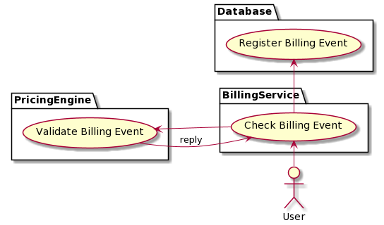
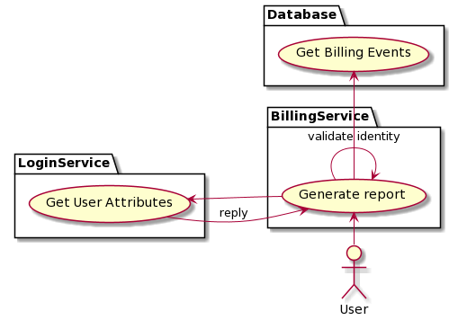

[[mainOverview]]
= Overview

== Building Block Overview

[NOTE]
.Content Description
================================
This section contains:

* High-Level Description of the Building Block
* Context within EOEPCA
================================

The main functionality of the Billing Service is to serve as an internal platform capable of processing billing events, received either from internal or external components. In addition, it will also serve as an authoritative source for the Policy Decision Point, in establishing resource access. In order to do so, several functionality blocks are identified:

* Billing Event Check Endpoint. An endpoint to allow for the validation of received billing events from either internal or external components.
* Billing Report Endpoint. An endpoint to allow for the generation of billing reports upon request by a validated billing identity.
* (Possibility) Billing Identity Generation Endpoint. Depending on business needs, BIS can also implement an endpoint to generate and associate billing identities with user identities.
* Pricing Check. Internal component to allow the Billing Service to communicate with the Pricing Engine.
* Billing Event Database. A local persistent database for storing Billing Events, and user and billing identity associations.
* SCIM Client, allowing to persist and retrieve user attributes necessary for the Billing Service.
* OIDC Client, used by the Billing Service to identify itself as trusted party within the architecture.

=== Initialization flow

The figure below, identifies the main workflows on which the BIS Engine participates, along with it's components:

When launched, the BIS will answer to all requests to 2 specific paths:

. Billing Check (/validate): To perform billing event's checks, using POST operations. Available to both internal and external components
. Billing Report (/report): To generate requested billing reports, using POST operations. Available to both internal and external components
. (possibility) Billing Identity Generation (/identity): To generate a billing identity, and associate with a user identity, using POST operations. Available to internal components.

The requests should be accompained by an "Authorization: Bearer <valid_RPT>" for all endpoints.

[cols="4*"]
|===
| Token | Request to BIS | BIS Action | BIS answer

| No RPT/OAuth token | bis.domain.com | None (request does not get to BIS endpoint) | None (the BIS doesn't see this request)
| No RPT/OAuth token and Valid data | bis.domain.com/validate with a billing event | None (no auth token) | 403
| RPT/OAuth token and Valid data | bis.domain.com/validate with a billing event | Validates the contained billing event | Return a OK/NOK response
| No RPT/OAuth token | bis.domain.com/report with a billing identity | None (no auth token) | 403
| RPT/OAuth token | bis.domain.com/report with a billing identity | Validates the billing identity against auth token and generates report | Return either report or a 403 response
| No RPT/OAuth token | bis.domain.com/identity | None (no auth token) | 500
| RPT/OAuth token | bis.domain.com/identity | Generates billing identity and associates against auth token user identity | Return either OK or a 403 response

|===

== External Interfaces

=== Exposed Interfaces

==== Billing Check (from internal or external PDPs and other components)

The BIS exposes a billing event check endpoint, which accepts a billing event as data and checks for validity. This validity is performed by calling the Pricing Engine to ascertain resource access status.

The BIS also persists billing events for usage on its internal database.

==== Billing Report (from other components)

The BIS generates a billing report, accepting as input a billing identity and checking for validity against a user profile.

This validity is performed by querying the Login Service with the OIDC connector, to ascertain if the billing identity and user identity are a match, before issuing the report.

==== (possibility) Billing Identity Generation (from internal components)

A possible interface to generate a billing identity, and associate it with the passed user identity in the authentication token

One possible implementation is to have the association step done via OIDC with the Login Service, to comply with data privacy laws, instead of a local database.

=== Consumed Interfaces

==== OIDC (to Login Service) 

The BIS uses the OIDC protocol in order to authenticate itself as a valid UMA client, and uses this OIDC client in all UMA-related queries. It allows Clients to verify the identity of the End-User. (https://gluu.org/docs/gluu-server/4.0/admin-guide/openid-connect/)

These queries are done against the Login Service, and the endpoints used are:

* Discovery Endpoint: /.well-known/openid-configuration

And the keys used from Well Known Handler:

* Token Endpoint: KEY_OIDC_TOKEN_ENDPOINT
* UserInfo Endpoint: KEY_OIDC_USERINFO_ENDPOINT

==== SCIM (to Login Service)

The BIS has the capability to auto-register itself as a client if there is no client pre-configured from previous starts or previous configuration. In order to do this, it utilizes the SCIM protocol which is designed to reduce the complexity of user management operations. (https://gluu.org/docs/gluu-server/3.1.1/user-management/scim2/)

The keys used from Well Known Handler:

* User Atributes: KEY_SCIM_USER_ENDPOINT
* Private Key JWT Key: ENDPOINT_AUTH_CLIENT_PRIVATE_KEY_JWT

==== Pricing check (to Pricing Engine)

The BIS itself does not interpret the Billing Events received. Instead, it relies on the Pricing Engine's checks to validate the event and produce an outcome.

== Internal Interfaces

=== Back-End database

The BIS stores billing events for future usage, such as billing identity verification and billing report generation.

== Required resources

[NOTE]
.Content Description
================================
This section contains:

* List of HW and SW required resources for the correct functioning of the building Block
* References to open repositories (when applicable)

================================

=== Software

The following Open-Source Software is required to support the deployment and integration of the Policy Enforcement Point:

* EOEPCA's SCIM Client - https://github.com/EOEPCA/um-common-scim-client
* EOEPCA's OpenID - https://github.com/EOEPCA/um-common-oidc-client
* EOEPCA's Well Known Handler - https://github.com/EOEPCA/well-known-handler
* Flask - https://github.com/pallets/flask
* MongoDB for python - https://pymongo.readthedocs.io/en/stable/index.html

== Static Architecture 

[NOTE]
.Content Description
================================
This section contains:

* Diagram and description of the major logical components within the Building Block

================================

With the diagram below, you can see how the connection between the back-end database and the bis-engine:

The BIS is composed of two main components:

* The BIS service (related to the endpoint that are exposed): This component will expose and consume the endpoints that we commented before. For this it will be necessary to establish a client for SCIM and another for OIDC.

* And a Back-end Database: This component store all information related to billing events and serves as backbone for the endpoint's functions.

The next section <<mainDesign>>:: contains detailed descriptions and references needed to understand the intricacies of this component.

== Use cases

[NOTE]
.Content Description
================================
This section contains:

* Diagrams and definition of the use cases covered by this Building Block

================================

=== Billing Event Check Use Case

When the BIS receives a request on the Billing Event Check endpoint, we proceed to validate it, by passing data to the Pricing Engine for checks. This data consists of the billing identity and the list of resources being accessed.

Upon positive response from the Pricing Engine, we store the Billing Event on the local database, for future reporting, and reply to the request.

If the Pricing Engine denies a check, the BIS denies the Event check.

=== Billing Report generation

When the BIS receives a request on the Billing Report endpoint, we proceed to check the received billing identity, present in the data parameter, against the user identity contained in the passed authentication token, in the header, by using the OIDC endpoint of the Login Service.

If validation is successful, the BIS then proceeds to query the local database for billing events that match the billing identity, and replies with an array in json format, containing the matching events.

If validation is unsucessful, the BIS denies the request.

=== (possibility) Billing Identity generation

The BIS uses billing identities to validate billing report generation. One possibility is to have a specific endpoint on the BIS for generation of these ids, and association between these and user identities.

One possible implementation is, after generation of an id, having the BIS contact the Login Service using the OIDC connector, to add the id to a custom user attribute, specified at the Login Service level. This implementation has the bonus of being able to associate several billing identities per user identity.