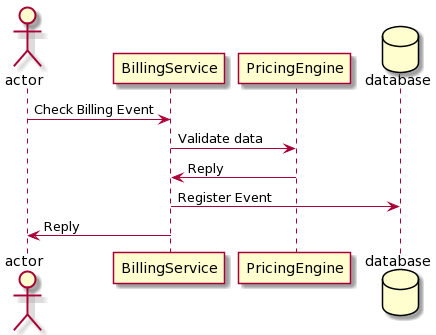
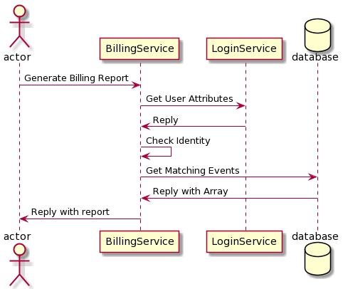

[[mainDesign]]
= Building Block Design

[NOTE]
.Content Description
================================
This section contains:

* A concise breakdown of the Building Block in several independent services (when applicable). For each component, the following subsections are added:
** Overview and purpose: indicating the functionality covered by the component
** SW Reuse and Dependencies: indicating reuse of third party open source solutions (if any) and any pre-required Dependencies
** Interfaces: both internal to the building block and those exposed externally
** Data: Data usage of the building block, data flow and any GDPR concerns should be addressed here
** Applicable Resources: links and references to (Reference Docs), and repositories.

When a breakdown is necessary, a general overview of the building block can be given. On the contrary, no breakdown indicates a single component development with the same expected sections.

================================

== Billing Event check

=== Overview and Purpose
The Flask-based endpoint allows to query for billing event validation. For this task, the BIS itself does not need to interpret billing event data, only needing to split data into logic units, and forward these to the price check endpoint of the Pricing Engine.

For purposes of reporting, the billing events are persisted on the local repository.

=== Software Reuse and Dependencies

All requirements for the executing of the reverse proxy are found under src/requirements.txt, and expect Python 3.6.9 or greater to work.

The most important are:

* **EOEPCA-SCIM**: Used as a complementary measure to the XACML passing of client assertions.
* **EOEPCA-OIDC**: Used to auto-register itself as a client to the Auth. Server upon start-up.
* **WellKnownHandler**: Used to dynamically check the configuration of the Authorization Server on each execution. For example, it can get the needed endpoints for any API the PDP needs, such as the token request for OIDC.
* **Flask**: External to EOEPCA's project, this library allows the PDP to expose its endpoints.
* **MongoDB**: Used to storage the policies for every resource, with the possibility of performing actions such as insert policies, modify, delete, etc

=== Interfaces

This component doesn't have any internal interfaces. For a reference of external interfaces see <<External Interfaces>> on Section 2 <<Overview>>

=== Data

==== Configuration

The BIS gets all its configuration from the file located under config/config.json.

The parameters that are accepted, and their meaning, are as follows:

- **prefix**: "/path"-formatted string to indicate where the reverse proxy should listen. Default is "/bis"

- **host**: Host for the proxy to listen on. For example, "0.0.0.0" will listen on all interfaces

- **port**: Port for the proxy to listen on. By default, 5569. Keep in mind you will have to edit the docker file and/or kubernetes yaml file in order for all the prot forwarding to work.

- **check_ssl_certs**: Toggle on/off (bool) to check certificates in all requests. This should be forced to True in a production environment

- **debug_mode**: Toggle on/off (bool) a debug mode of Flask. In a production environment, this should be false.

==== Data flow

The only information the BIS handles is billing event data from the request.

What follows is an example of the nominal flow for the BIS:

=== Extensibility

The design of the BIS allows for further improvements if need be. For example:

- The proxy can be expanded to parse further parameters on top of the HTTP protocol, allowing for any kind of plugin or complex mechanism desired.

=== Applicable Resources

* EOEPCA's SCIM Client - https://github.com/EOEPCA/um-common-scim-client
* EOEPCA's OIDC Client - https://github.com/EOEPCA/um-common-uma-client
* EOEPCA's Well Known Handler - https://github.com/EOEPCA/well-known-handler
* Flask - https://github.com/pallets/flask
* EOEPCA's Pricing Engine - https://github.com/EOEPCA/um-common-scim-client
* MongoDB for python - https://pymongo.readthedocs.io/en/stable/index.html

== Billing Report generation
=== Overview and Purpose
The BIS is capable of generation billing reports based on a billing identity that is received with the request.

For this, the BIS validates the received billing identity against the user profile, and generates the report based on the billing events present on the local database.

=== Applicable Resources

* EOEPCA's SCIM Client - https://github.com/EOEPCA/um-common-scim-client
* EOEPCA's OIDC Client - https://github.com/EOEPCA/um-common-uma-client
* EOEPCA's Well Known Handler - https://github.com/EOEPCA/well-known-handler
* Flask - https://github.com/pallets/flask
* MongoDB for python - https://pymongo.readthedocs.io/en/stable/index.html

=== Interfaces

This component doesn't have any internal interfaces. For a reference of external interfaces see <<External Interfaces>> on Section 2 <<Overview>>

=== Data

==== Data flow

The BIS handles the received billing identity and auth token to verify association between user and identity..

What follows is an example of the nominal flow for the BIS:

== Billing Event Repository
=== Overview and Purpose
It is the database based on MongoDB where the billing events are stored and queried for billing report generation.

Included with the BIS there is a script at the source path that performs queries against a Mongo Database. The main purpose of this script is to reduce the usage of RAM when registering an event locally and when querying for its content.
It is developed to generate a database called 'billing_db' in case it does not exist. The collection used for the storage of the documents is called 'events'.
The main functionalities are:

* **Insert event**: Will generate a document with the event data received as input. Each event shall be unique, and no update actions are available. The main parameters of the policy would be an auto-generated id provided by mongo which identify each document in the database, the billing identity of the event, and the event data itself. This would be mandatory parameters in order to perform other kind of queries.
* **Get event from billing identity**: Finds all event data that matches a billing identity. Returns a list of events in json format.
* **Delete event**: Will receive an entry id and will find and delete the matched document
* **Delete event by billing identity**: Will receive a billing identity and clear the database of all matching events

This script is manipulated by the API.

=== Software Reuse and Dependencies

At the moment the usage is mainly for event storage and report generation.

=== Data flow

Any data is managed internally, without outside access.

=== Applicable Resources

* MongoDB image from DockerHub - https://hub.docker.com/_/mongo
